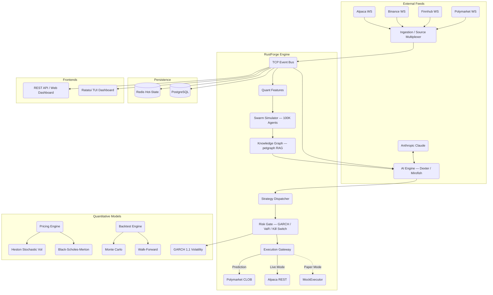

# RustForge Terminal (rust-finance)

<div align="center">
  
  
  
  
  
  <br />
  <a href="https://github.com/Ashutosh0x/rust-finance/stargazers"></a>
  <a href="https://github.com/Ashutosh0x/rust-finance/network/members"></a>
  <br />
  
  
  
  
  <br />
  
  
  
  
  
  
  
  <br />
  
  
  
  <br />
  <a href="https://scorecard.dev/viewer/?uri=github.com/Ashutosh0x/rust-finance"></a>
  <a href="https://github.com/Ashutosh0x/rust-finance/actions/workflows/security.yml"></a>
  <a href="https://github.com/Ashutosh0x/rust-finance/actions/workflows/test.yml"></a>
  <a href="https://deps.rs/repo/github/Ashutosh0x/rust-finance"></a>
  <a href="https://opensource.org/licenses/MIT"></a>
</div>

---

## Overview

RustForge is an institutional-grade AI trading terminal built in pure Rust. It combines real-time multi-exchange market data, Claude-powered AI analysis, quantitative risk management, prediction market trading, and a full TUI dashboard — all in a single binary with nanosecond-precision timestamps and sub-millisecond latency.

| Feature | Detail |
|:---|:---|
| Language | Pure Rust |
| Interface | Full TUI Dashboard (Ratatui, 6 screens) |
| AI Integration | Claude-powered Dexter Analyst |
| Prediction Markets | Polymarket CLOB with EIP-712 signing |
| Agent Simulation | 100K-agent Rayon-parallel swarm |
| Knowledge Graph | petgraph-backed RAG engine |
| Risk Models | GARCH(1,1) + VaR + Kill Switch + Interceptor Chain |
| Timestamp Precision | Nanosecond (`UnixNanos`) |
| Deterministic Replay | `DeterministicClock` + `SequenceId` ordering |
| Market Sources | Alpaca, Binance, Finnhub, Polymarket, Mock |
| Execution | Alpaca REST, Polymarket CLOB, Paper Trading |
| License | MIT |


---

## Table of Contents
- [Overview](#overview)
- [Architecture](#architecture)
- [Quick Start](#quick-start)
- [Features](#features)
- [TUI Hotkeys](#tui-hotkeys)
- [Performance](#performance)
- [Configuration](#configuration)
- [Strategy Development](#strategy-development)
- [API Reference](#api-reference)
- [Troubleshooting](#troubleshooting)
- [License and Disclaimer](#license-and-disclaimer)

---

## Architecture

34 modular crates, 110+ source files, strict dependency boundaries.



### Crate Map

```
common           Nanosecond timestamps, events, config, models
ingestion        Multi-source market data (Alpaca, Binance, Finnhub, Polymarket)
execution        Trait-based ExecutionGateway, AlpacaExecutor
strategy         Strategy trait, momentum, mean-reversion engines
risk             Kill switch, GARCH vol, VaR, risk interceptor chain
pricing          Black-Scholes-Merton, Heston, GARCH(1,1) models
backtest         Walk-forward, Monte Carlo, backtesting engine
ai               Dexter AI analyst, Claude integration, signal routing
swarm_sim        100,000-agent market microstructure simulator
knowledge_graph  petgraph-backed RAG knowledge engine
polymarket       Polymarket (3 APIs: Gamma, CLOB, Data) + EIP-712 signing
daemon           Hybrid intelligence pipeline, engine orchestration
event_bus        Postcard-serialized TCP event bus (daemon <-> TUI)
tui              Ratatui-powered 6-screen trading dashboard
oms              Order Management System (netting + hedging)
alerts           Rule-based alert engine
signals          Technical indicator signal generation
compliance       Pre-trade compliance, audit trail
persistence      PostgreSQL + SQLite persistence layer
metrics          Prometheus-compatible telemetry
ml               Machine learning model inference
model            Model registry and versioning
feature          Feature engineering pipeline
fix              FIX protocol adapter
cli              Command-line interface
web              REST API server
web-dashboard    Web-based dashboard
dashboard        Dashboard data models
tests            Integration test suite
benchmarks       Criterion performance benchmarks
```

---

## Quick Start

```bash
# 1. Install Rust
curl --proto '=https' --tlsv1.2 -sSf https://sh.rustup.rs | sh

# 2. Clone
git clone https://github.com/Ashutosh0x/rust-finance.git
cd rust-finance

# 3. Configure
cp .env.example .env
# Edit .env — add your API keys (see Configuration below)

# 4. Build
cargo build --release

# 5. Run (mock mode — no API keys required)
USE_MOCK=1 cargo run -p daemon --release

# 6. Run TUI (separate terminal)
cargo run -p tui --release
```

---

## Features

### Core Engine
- Hybrid Intelligence Pipeline — Quant, Swarm, Knowledge Graph, Dexter AI, Risk Gate, Execution
- Nanosecond-precision timestamps (`UnixNanos`) with monotonic `SequenceId` ordering
- Swappable clock — `RealtimeClock` for live trading, `DeterministicClock` for backtesting
- Event-driven architecture with typed `Envelope<T>` wrapping every system event
- Deterministic Safety Gate — zero-AI verification layer preventing agent confirmation bias
- 30-crate workspace compiling in ~17s

### Market Data
- **Alpaca** — Real-time US equities via WebSocket (5 feeds: IEX, SIP, BOATS, Delayed, Overnight)
- **Binance** — Crypto streams (trades, bookTicker, depth5) via combined WS endpoint
- **Finnhub** — Global market data (incl. NSE/BSE) and live trades via WebSocket
- **Polymarket** — Prediction market data via 3 APIs:
  - **Gamma API** — Events, markets, tags, search, profiles (`gamma-api.polymarket.com`)
  - **CLOB API** — Orderbook, midpoint, spread, prices-history, tick-size, fee-rate (`clob.polymarket.com`)
  - **Data API** — Positions, trades, leaderboards, open interest (`data-api.polymarket.com`)
- **Mock source** — Deterministic replay for backtesting
- Auto-reconnect with exponential backoff on all sources
- Source Multiplexer — unified `SelectAll` stream from any combination of sources

### AI Intelligence
- **Dexter AI Analyst** — Claude-powered market analysis with structured signal output
- **100K Agent Swarm Simulation** — Rayon-parallel microstructure Monte Carlo
- **Knowledge Graph** — petgraph RAG with entity linking and context fusion
- **Fused Context** — Quant + Swarm + Graph consensus fed into Dexter prompt
- **Impact Analysis Engine** — AI-driven market impact estimation
- **Mirofish** — 5,000-agent scenario simulator (rally/sideways/dip probabilities)

### Execution
- `ExecutionGateway` trait — plug-and-play execution backends
- **Alpaca Executor** — Full REST integration (25+ endpoints: orders, positions, assets, historical data)
- **Polymarket CLOB** — full order lifecycle (limit/market/FOK/GTC/GTD), EIP-712 signed orders
- **Polymarket BTC 15-Min** — Crypto prediction markets (BTC Up/Down, ETH, SOL, XRP, DOGE)
- **Paper trading** — MockExecutor for risk-free strategy testing
- **Bracket orders** — OCO/OTO stop-loss + take-profit combos
- **Trailing stops** — dynamic stop-loss that follows price

### Risk Management
- **Deterministic Safety Gate** — zero-AI verification layer detecting agent confirmation bias (>85% agreement), concentration, drawdown, and correlation exposure
- **Kill Switch** — emergency circuit breaker (hotkey `K` in TUI)
- **GARCH(1,1) Volatility** — real-time volatility estimation
- **Value at Risk (VaR)** — parametric + historical VaR calculation
- **PnL Attribution** — component-level profit/loss decomposition
- **Risk Interceptor Chain** — composable pre-trade risk checks
- **Kelly Criterion Sizing** — optimal position sizing
- Max Drawdown and Daily Loss Limit trading guardrails

### Quantitative Models
- **Black-Scholes-Merton** — options pricing with Greeks
- **Heston Stochastic Volatility** — smile-calibrated pricing
- **GARCH(1,1)** — volatility forecasting (`sigma_t^2 = omega + alpha * epsilon_{t-1}^2 + beta * sigma_{t-1}^2`)
- **Monte Carlo Engine** — path simulation for derivative pricing
- **Walk-Forward Backtesting** — out-of-sample validation
- **Latency Queue** — priority-queue latency simulation for realistic fills

### TUI Dashboard
- 6-screen navigation — Dashboard, Charts, Orderbook, Positions, AI, Settings
- Real-time sparkline charts with zoom, scroll, and time range cycling
- Live order book visualization — L2 depth with cumulative volume
- 13-symbol watchlist auto-updating from market data feed
- Exchange heartbeat monitor — NYSE, NASDAQ, CME, CBOE, LSE, CRYPTO, NSE, BSE
- Dexter AI panel with live analysis output and BUY/SELL/HOLD recommendation
- Mirofish simulation widget — rally/sideways/dip probability bars
- Buy/Sell order entry dialogs with quantity and price inputs
- Emergency controls — kill switch, paper/live toggle, risk adjustment

### Compliance and Audit
- Full audit trail — every state transition logged with `AuditTick`
- Pre-trade compliance — rule-based order validation
- Deterministic replay — reproduce any historical trading session

### News Feed Sources
- **Finnhub News API** — general market news, company-specific news, sector news
- **Alpaca News API** — US equities breaking news, earnings, SEC filings
- **NewsAPI.org** — aggregates Reuters, Bloomberg, CNBC, WSJ, Financial Times, BBC Business
- **Polygon.io** — SEC filings, earnings reports, company reference data
- **BSE/NSE RSS** — Indian market news from Bombay and National Stock Exchanges
- **CoinGecko** — cryptocurrency market news and sentiment
- **SEC EDGAR** — real-time regulatory filings (10-K, 10-Q, 8-K)

---

## TUI Hotkeys

| Hotkey | Action |
|:---|:---|
| `Tab` / `Shift+Tab` | Cycle between panels |
| `B` | Open BUY dialog |
| `S` | Open SELL dialog |
| `Enter` | Confirm order |
| `Esc` | Dismiss dialog |
| `K` | KILL SWITCH — emergency halt all trading |
| `M` | Toggle paper/live mode |
| `+` / `-` | Adjust risk threshold |
| `D` | Trigger Dexter AI analysis |
| `F` | Run Mirofish simulation |
| `Z` / `X` | Chart zoom in/out |
| `Left` / `Right` | Chart scroll |
| `T` | Cycle chart time range |
| `E` | Export data to CSV |
| `R` | Refresh portfolio |
| `?` | Toggle help overlay |
| `Q` | Quit |

---

## Performance

| Component | Benchmark | Execution Time |
|:---|:---|:---|
| Tick Pipeline | Order book mutation | ~40 ns |
| Pricing Models | BSM European Call | ~34 ns |
| Risk Constraints | GARCH(1,1) Update | ~2.3 ns |
| Risk Constraints | Branchless Safety Check | ~1.6 ns |
| Event Bus | Postcard serialization | Zero-copy binary |
| Swarm Sim | 100K agents | Rayon parallel |
| Timestamps | `UnixNanos` precision | Nanosecond |
| Event Ordering | `AtomicU64` sequence | Lock-free |

Release profile: `opt-level=3`, `lto=fat`, `codegen-units=1`, `strip=true`

---

## Configuration

### API Keys Required

| Service | Environment Variable | Purpose | Free Tier |
|:---|:---|:---|:---|
| Alpaca | `ALPACA_API_KEY`, `ALPACA_API_SECRET` | US equities market data + execution | Yes (paper trading) |
| Finnhub | `FINNHUB_API_KEY` | Market data + news API | Yes (60 calls/min) |
| Anthropic | `ANTHROPIC_API_KEY` | Dexter AI analyst (Claude) | No (pay-per-token) |
| NewsAPI.org | `NEWSAPI_KEY` | Aggregated news (Reuters, Bloomberg, WSJ) | Yes (100 req/day) |
| Polygon.io | `POLYGON_API_KEY` | Options chains (GEX), reference data, news | Yes (5 calls/min) |
| Polymarket | `POLYMARKET_PRIVATE_KEY`, `POLYMARKET_FUNDER_ADDRESS` | Prediction market trading (EIP-712) | N/A (needs ETH wallet) |
| Telegram | `TELEGRAM_BOT_TOKEN`, `TELEGRAM_CHAT_ID` | Alert notifications | Yes |
| Discord | `DISCORD_WEBHOOK_URL` | Alert notifications | Yes |

### Setup

1. Copy the example environment file:
   ```bash
   cp .env.example .env
   ```

2. Edit `.env` and add your API keys (see table above).

3. Quick test with no API keys required:
   ```bash
   USE_MOCK=1 cargo run -p daemon --release
   ```

See [docs/SETUP.md](docs/SETUP.md) for step-by-step key creation instructions.
See [docs/CONFIGURATION.md](docs/CONFIGURATION.md) for the full configuration reference.

---

## Strategy Development

Strategies are implemented in the `strategy` crate using the `PluggableStrategy` async trait:

1. Define your strategy struct and internal state
2. Implement `on_market_event()` to process live tick data
3. Emit `TradeSignal` objects with desired positions and dynamic confidences
4. Register in the daemon's strategy registry for hot-swapping

For examples, see `AiGatedMomentum` in `crates/daemon/src/strategy_registry.rs`.

---

## API Reference

| Endpoint | Port | Protocol |
|:---|:---|:---|
| Market Data Ingestion | `4310` | WebSocket |
| Event Bus (daemon to TUI) | `7001` | TCP + Postcard |
| Prometheus Metrics | `3000` | HTTP GET `/metrics` |
| Tracing Export (Jaeger) | `4318` | OTLP UDP |

### Alpaca Broker Integration
- `POST /v2/orders` — order submission via `AlpacaBroker::submit_order`, rate-limited to 150 req/min
- `GET /v2/positions` — periodic position reconciliation into TUI

### Polymarket CLOB Integration
- `POST /order` — EIP-712 signed order placement
- `DELETE /order/{id}` — cancel specific order
- `DELETE /cancel-all` — cancel all open orders
- `GET /orders` — list open orders
- `GET /book` — order book snapshot
- `GET /midpoint` — midpoint price
- `GET /balance-allowance` — USDC balance

---

## Troubleshooting

- **Build errors on Solana crates**: The legacy `parser`, `executor`, `signer`, and `relay` crates are excluded from the workspace due to a yanked `solana_rbpf` dependency. They are replaced by `crates/ingestion` and `crates/execution` in the v2 architecture.
- **WebSocket timeout**: Ensure your Finnhub/Alpaca API keys are correct. `reconnect.rs` will log warnings on exponential backoff attempts.
- **Missing API keys**: Run in mock mode with `USE_MOCK=1` to test without any API keys.
- **TUI not connecting**: Start the daemon first (`cargo run -p daemon`), then the TUI (`cargo run -p tui`) in a separate terminal. The TUI connects via TCP to `127.0.0.1:7001`.

---

## License and Disclaimer

> **WARNING**
> This software is provided for educational and research purposes only. The authors are not responsible for any financial losses incurred from running autonomous code on live capital.

MIT License (c) 2026 Ashutosh0x
