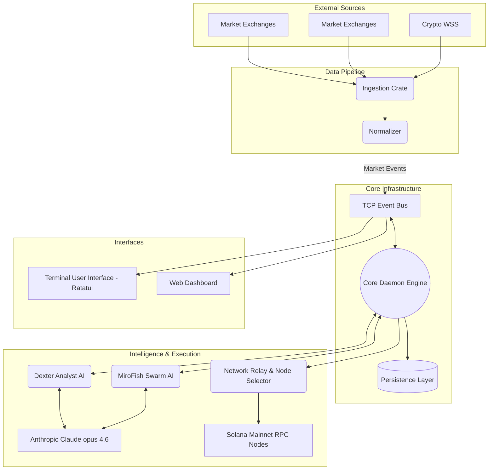

# RustForge Terminal (rust-finance)

<div align="center">
  
  
  
  
  
  
</div>

A high-performance, low-latency trading terminal and daemon built completely in Rust. Engineered for direct connection to market data streams (Finnhub, Alpaca), real-time AI signal analysis, and Solana-based trade execution.


 
## System Architecture



## Workspace Crates

The workspace is organized into discrete, highly decoupled crates:

* **`daemon`**: The central orchestrator. It manages the Tokio asynchronous runtime, spawns the EventBus, starts ingestion pipelines, controls the AI analyst intervals, and routes signals to the execution engine.
* **`tui`**: A standalone Ratatui application featuring an advanced 3-column layout mimicking professional desktop terminals. It subscribes to the `event_bus` to render watchlists, deep order books, high-res braille charts, and live AI intelligence.
* **`ai`**: Contains `DexterAnalyst` and `MiroFishSimulator`. Interacts natively with Anthropic APIs to detect catalysts, perform fundamental analysis, and run swarm probability algorithms on market feeds.
* **`ingestion`**: Connects to `Finnhub` and `Alpaca` WebSockets. Normalizes trade and quote data into a standard `MarketEvent` format and pumps it into the system at extremely low latency.
* **`relay`**: Handles network routing and edge measurement. Specifically benchmarks multiple RPC nodes (Helius, Triton, QuickNode) and routes transactions through the lowest-latency path available.
* **`event_bus`**: A custom-built, lightweight TCP broadcasting system that decouples producers and consumers. Allows the TUI and Web Dashboards to run in entirely separate processes from the Daemon.
* **`persistence`**: Storage layer designed to record transactional records, system P&L tracking, and order history.
* **`common`**: Shared models, structs, commands, and `BotEvent` enumerations used across all systems to guarantee strict typing on inter-process communications.

## Configuration & Usage

The system expects several environment variables to be set for external API integrations:

```sh
export ANTHROPIC_API_KEY="..."
export FINNHUB_API_KEY="..."
export ALPACA_API_KEY="..."
export ALPACA_SECRET_KEY="..."
export USE_MOCK="1" # Enables mocked market generation for UI testing
```

### Running the System

Start the background daemon process first:
```sh
cargo run -p daemon --release
```

In a separate terminal, launch the Terminal User Interface:
```sh
cargo run -p tui --release
```

## UI and Visual Constraints

The TUI utilizes `Constraint::Length` and custom Ratatui widget styling to enforce a strict immutable grid layout. Custom hex colors have been applied globally to match a proprietary theme design.
