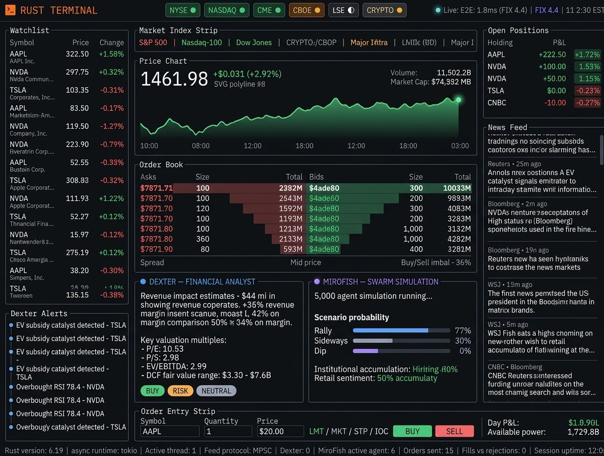
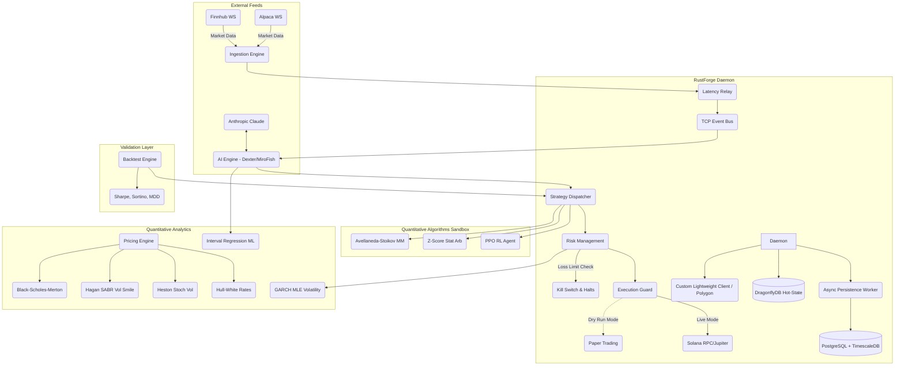

# RustForge Terminal (rust-finance)

<div align="center">
  
  
  
  
  
  
  
  
  
  <br />
  <a href="https://github.com/Ashutosh0x/rust-finance/stargazers"></a>
  <a href="https://github.com/Ashutosh0x/rust-finance/network/members"></a>
  <br />
  
  
  
  
  
  
  
  
  
  
  
  
  
  
  
  <br />
  
  
  
</div>

## Overview

A Rust-based trading terminal for market data visualization, educational quantitative pricing models, and paper trading simulation. It explores real-time asynchronous architecture using Tokio, TUI rendering with Ratatui, and mock order execution layers.

>  **Status: Early Stage / Educational**  
> This project is under active development as a free-time educational endeavor. It is **not** suitable for live trading with real capital. It is not professional financial software, lacks regulatory testing, and relies internally on mocked systems or experimental components.





## What It Does
- Connects to Finnhub and Alpaca WebSocket streams for real-time market data
- Integrates with Polymarket CLOB and Gamma APIs for decentralized prediction markets
- Renders a multi-panel dashboard natively in the terminal using Ratatui
- Explores educational implementations of pricing models (BSM, Heston approximations)
- Submits simulated/paper trades via Alpaca REST APIs
- Tracks target proxy wallets for copy-trading on Polymarket
- Includes experimental AI signal commentary integrations (via Anthropic API)

## What It Doesn't Do (Out of Scope)
- Production-grade Institutional Order Management
- Real FIX 4.4 protocol message serialization
- Institutional SEBI or SEC regulatory limit compliance
- Ultra high-frequency trading (no kernel bypass, no FPGA)

## Table of Contents
- [Overview](#overview)
- [Architecture](#architecture)
- [Features](#features)
- [Project Structure](#project-structure)
- [Quick Start](#quick-start)
- [Configuration](#configuration)
- [Components Deep Dive](#components-deep-dive)
- [Running the System](#running-the-system)
- [Strategy Development](#strategy-development)
- [API Reference](#api-reference)
- [Troubleshooting](#troubleshooting)
- [License & Disclaimer](#license--disclaimer)

## Architecture



## Project Structure

The workspace is organized into discrete, highly decoupled crates:

* **`daemon`**: The central orchestrator. It manages the Tokio asynchronous runtime, spawns the EventBus, starts ingestion pipelines, controls the AI analyst intervals, and routes signals to the execution engine.
* **`tui`**: A standalone Ratatui application featuring an advanced 3-column layout mimicking professional desktop terminals. It subscribes to the `event_bus` to render watchlists, deep order books, high-res braille charts, and live AI intelligence.
* **`ai`**: Contains `DexterAnalyst` and `MiroFishSimulator`. Interacts natively with Anthropic APIs to detect catalysts, perform fundamental analysis, and run swarm probability algorithms on market feeds.
* **`ingestion`**: Connects to `Finnhub` and `Alpaca` WebSockets. Normalizes trade and quote data into a zero-allocation `MarketEvent` format (using `compact_str`) to eliminate heap allocations on the hot path.
* **`relay`**: Handles network routing and edge measurement. Specifically benchmarks multiple RPC nodes (Helius, Triton, QuickNode) and routes transactions through the lowest-latency path available.
* **`event_bus`**: Powered by `tokio::sync::broadcast` and `postcard` binary serialization for zero-copy, microsecond-latency network message transitions between the Daemon and UI.
* **`polymarket`**: Interacts with the Polymarket prediction market smart contracts on the Polygon blockchain via a custom, lightweight, zero-dependency-conflict client (using `reqwest` and `ethers-core`). Includes websocket streaming and copy trading wallet monitoring.
* **`swarm_sim`**: A comprehensive multi-agent financial market swarm simulation engine. Integrates agent profiles (Retail, Hedge Fund, Market Maker, etc.) to model complex market behaviors, sentiment shocks, and price impacts concurrently using rayon.
* **`persistence`**: Storage layer designed to record transactional records, system P&L tracking, order history, and large-scale action logs for swarm agents.
* **`common`**: Shared models, structs, commands, and `BotEvent` enumerations used across all systems to guarantee strict typing on inter-process communications.

## Configuration

1. Copy the example environment file:
   ```bash
   cp .env.example .env
   ```

Edit `.env` and add your API keys. See the [Setup Guide (docs/SETUP.md)](docs/SETUP.md) for step-by-step key creation instructions.

Quick test (no keys required):
```bash
USE_MOCK=1 cargo run -p daemon --release
```

For the full configuration reference, see [docs/CONFIGURATION.md](docs/CONFIGURATION.md).

Start the background daemon process first:
```sh
cargo run -p daemon --release
```

In a separate terminal, launch the Terminal User Interface:
```sh
cargo run -p tui --release
```

### Features
* **Real-time Market Data:** Connections to Finnhub and Alpaca WebSocket streams.
* **Asynchronous Routing:** Leverages Tokio's MPSC and Broadcast channels for component communication.
* **Daemon Resilience (WIP):** Experimental `circuit_breaker.rs` framework representing system protections.
* **Educational Quantitative Models (`pricing`):** Basic frameworks for **Black-Scholes-Merton** integration and volatility tracking.
* **Simulation Risk Constraints (`risk`):** Basic VaR checks and drawdown halts simulated in the execution path.
* **Swarm Intelligence Simulator (`swarm_sim`):**
    * Multi-threaded agent testing engine utilizing `rayon` to simulate concurrent market participant actions.
    * Explores macro shocks and synthetic order book dynamics.
* **AI Signal Annotations:**
    * Interacts with Anthropic Claude models for experimental financial text analysis.
* **Terminal UI (TUI):** A dashboard rendered directly in your terminal using Ratatui. Employs `Constraint::Percentage` for responsive layouts across multiplexers, rendering high-speed Braille price charts utilizing the native `ratatui::widgets::Canvas`.
* **Simulated Execution Tracking (Stubbed/WIP):** Educational mock order routing, basic pre-trade limit assertions, and abstract messaging layers framework.
* **Order Management System (OMS - Educational):** Educational tracking of abstract position flipping, unrealized PNL arrays, basic VWAP modeling, and background asynchronous 5-second `GET /v2/positions` reconciliation.
* **Backtesting Engine (WIP):** An educational framework exploring standard quantitative simulation approaches and constraints.
* **Ultra-Low Latency Database (WIP/Stubbed):**
    * **Hot-State Memory:** Experimental `DragonflyDB` concepts caching live abstract portfolios.
    * **Async Persistence Worker:** Experimental queues intended for later integration with TimescaleDB.

### Reference Architecture

| System Layer | Implementation Approach | Focus |
| :--- | :--- | :--- |
| **In-Process State** | Rust Memory / Channels | Safely routing discrete ticks |
| **Hot-State** | DragonflyDB / In-Memory Structs | Transient state storage |
| **Persistence**| PostgreSQL Worker (Stubbed/WIP) | Educational historical logs |

## Performance Benchmarks

*These metrics represent the theoretical performance of the isolated educational algorithms natively benchmarked using `criterion`, not a complete production system latency.*

| Component | Benchmark | Execution Time |
| :--- | :--- | :--- |
| **Tick Pipeline** | Order book mutation | ~40 ns |
| **Pricing Models** | BSM European Call | ~34 ns |
| **Risk Constraints** | GARCH(1,1) Update | ~2.3 ns |
| **Risk Constraints** | Branchless Safety Check | ~1.6 ns |


## Quick Start
1. Ensure you have Rust and Cargo installed (`curl --proto '=https' --tlsv1.2 -sSf https://sh.rustup.rs | sh`)
2. Clone the repository: `git clone https://github.com/Ashutosh0x/rust-finance.git`
3. Configure your API keys (see [Configuration](#configuration)).
4. Run the daemon and TUI in separate terminal windows (see [Running the System](#running-the-system)).

## Components Deep Dive

RustForge implements several mathematical formulations for educational study:

### 1. Heston Stochastic Volatility Model
Explores volatility smile mappings.
*   **Asset Price Dynamics:** `dS = μ·S·dt + √v·S·dW₁`
*   **Variance Dynamics:** `dv = κ·(θ - v)·dt + σ_v·√v·dW₂`
*   **Brownian Correlation:** `corr(dW₁, dW₂) = ρ·dt`

### 2. GARCH(1,1) Volatility Forecasting
Explores dynamic volatility forecasting.
*   **Conditional Variance Formulation:** `σ²_t = ω + α·ε²_{t-1} + β·σ²_{t-1}`

## Strategy Development
Strategies are written in the `strategy` crate by implementing the `PluggableStrategy` asynchronous trait:
1. Define your strategy struct and state.
2. Implement `on_market_event()` to process live tick data.
3. Emit `TradeSignal` objects containing desired positions and dynamic confidences.
4. Hot-swap the strategy within the `daemon` strategy registry.

For examples, review `AiGatedMomentum` inside `crates/daemon/src/strategy_registry.rs`.

## API Reference
**WebSocket Ingestion Ports**: `4310` (Market Data)
**Axum Promethus Metrics**: `GET /metrics` on port `3000`
**Tracing Export**: OTLP UDP via port `4318` (See docker-compose.yml for Jaeger configuration)

### Alpaca Broker API Integration
 RustForge fully integrates with the Alpaca Paper/Live v2 Trading REST API to dispatch stock and fiat executions transparently from the TUI.
 
 - **`POST /v2/orders`**: Submitted via the `AlpacaBroker::submit_order` async method bridging TUI dialogue events straight to Alpaca. It is protected by the `governor` concurrent token-bucket rate limiter (capping at 150 requests/min) to prevent API exhaustion bans.
 - **`GET /v2/positions`**: Periodically queried by the ingestion pipeline to map live execution statuses into the TUI Open Positions tables.

## Troubleshooting
- **Build Errors on `tokio` or `tracing` limits**: Make sure you have the exact toolchain and dependencies listed in the workspace `Cargo.toml`. 
- **Insufficient SOL Execution errors**: Provide a funded wallet address via `SOL_PRIVATE_KEY` base58 env var. The executor has a hardcoded `0.005 SOL` minimum balance rent safety check.
- **WebSocket Timeout**: Ensure your Finnhub/Alpaca connection allows your IP or that your API keys are correct. `reconnect.rs` will print warnings on exponential backoff attempts.

## License & Disclaimer
> [!WARNING]  
> This software is provided for **educational and research purposes only**. The authors are not responsible for any financial losses incurred from running autonomous code on live capital. 
> 
> *MIT License (c) 2026 Ashutosh0x*
