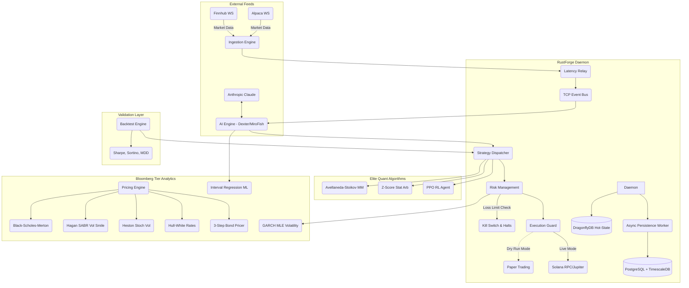

# RustForge Terminal (rust-finance)

<div align="center">
  
  
  
  
  
  
  <br />
  
  
  
  <br />
  
  
  
  
  
  
  
  
  
  
  
  
  
  
  
</div>

A high-performance, low-latency trading terminal and daemon built completely in Rust. Engineered for direct connection to market data streams (Finnhub, Alpaca), real-time AI signal analysis, and Solana-based trade execution.


## System Architecture



## Workspace Crates

The workspace is organized into discrete, highly decoupled crates:

* **`daemon`**: The central orchestrator. It manages the Tokio asynchronous runtime, spawns the EventBus, starts ingestion pipelines, controls the AI analyst intervals, and routes signals to the execution engine.
* **`tui`**: A standalone Ratatui application featuring an advanced 3-column layout mimicking professional desktop terminals. It subscribes to the `event_bus` to render watchlists, deep order books, high-res braille charts, and live AI intelligence.
* **`ai`**: Contains `DexterAnalyst` and `MiroFishSimulator`. Interacts natively with Anthropic APIs to detect catalysts, perform fundamental analysis, and run swarm probability algorithms on market feeds.
* **`ingestion`**: Connects to `Finnhub` and `Alpaca` WebSockets. Normalizes trade and quote data into a standard `MarketEvent` format and pumps it into the system at extremely low latency.
* **`relay`**: Handles network routing and edge measurement. Specifically benchmarks multiple RPC nodes (Helius, Triton, QuickNode) and routes transactions through the lowest-latency path available.
* **`event_bus`**: A custom-built, lightweight TCP broadcasting system that decouples producers and consumers. Allows the TUI and Web Dashboards to run in entirely separate processes from the Daemon.
* **`persistence`**: Storage layer designed to record transactional records, system P&L tracking, and order history.
* **`common`**: Shared models, structs, commands, and `BotEvent` enumerations used across all systems to guarantee strict typing on inter-process communications.

## Configuration & Usage

The system expects several environment variables to be set for external API integrations:

```sh
export ANTHROPIC_API_KEY="..."
export FINNHUB_API_KEY="..."
export ALPACA_API_KEY="..."
export ALPACA_SECRET_KEY="..."
export USE_MOCK="1" # Enables mocked market generation for UI testing
```

### Running the System

Start the background daemon process first:
```sh
cargo run -p daemon --release
```

In a separate terminal, launch the Terminal User Interface:
```sh
cargo run -p tui --release
```

## Features

* **Real-time Market Data:** Direct integrations with Finnhub and Alpaca WebSocket streams for sub-millisecond market events.
* **Low-Latency Order Execution:** Hardware-accelerated Solana RPC interactions via intelligent `relay` routing (`rpc_router.rs`) with EMA latency tracking and automatic failovers across Helius, Triton, and QuickNode.
* **Daemon Resilience:** Production-grade `circuit_breaker.rs` for RPC and API protections, exponential backoff WebSocket `reconnect.rs`, and an OS-level graceful `shutdown.rs` multiplexer.
* **Quantitative Pricing Analytics (`pricing`):** Bloomberg-grade option pricing frameworks including **Black-Scholes-Merton**, **Hagan SABR Volatility**, **Heston Stochastic Vol**, and **Hull-White Trinomial** trees. 
* **Fixed Income Modeling:** Implemented the exact BVAL 3-step algorithms and corporate WACC default computations native to institutional desks.
* **Advanced Risk Engines (`risk`):** Automated VaR checks, dynamic Drawdown halts, and **GARCH(1,1) Volatility forecasting**.
* **Dual AI Decision Engines (Anthropic Claude Opus 4.6 Powered):**
    * **Dexter Analyst AI:** Reads fundamental data and market news via **Opus 4.6**. Opus 4.6 outperforms GPT-5.2 by 144 Elo points on GDPval-AA evaluations (economically valuable finance constraints) making it the top financial analyst model globally.
    * **MiroFish Swarm AI:** Simulates 5,000 algorithmic agent iterations and runs via Agent Teams.
    * **Compaction API Integration:** Infinite deep context length allows the daemon to retain rolling multi-week token histories purely on server-side summarizations, reducing overhead significantly.
    * **NeurIPS 2025 Interval Regression:** Advanced multi-layer perceptron training natively on Bid/Ask spreads without lit prints.
* **Terminal UI (TUI):** A professional-grade, multi-column dashboard rendered directly in your terminal using Ratatui. Features high-res Braille price charts, live options chains (`options_chain.rs`), and live portfolio P&L tracking.
* **Institutional Execution Protocol:** Active SEBI pre-trade limits, bracket routing, and native FIX 4.4 serialization.
* **Ultra-Low Latency Tiered Database:**
    * **Hot-State Memory:** `DragonflyDB` caching live portfolios and AI signal structures completely lock-free.
    * **Async Persistence Worker:** Decoupled `tokio::mpsc` queue passing disk I/O onto `PostgreSQL 16` and **TimescaleDB** Hypertables supporting millions of inserts globally without locking the main thread.

### Reference Latency Architecture

| System Layer | Technology | Target Latency |
| :--- | :--- | :--- |
| **In-Process State** | Rust Memory / Lock-Free Ring Buffers | `~50 ns` |
| **Shared Hot-State** | DragonflyDB (Multi-threaded Redis) | `~0.2 - 0.5 ms` |
| **Historical Storage**| PostgreSQL 16 + TimescaleDB Async | `~2 - 5 ms` |

**Critical Trading Path (`memory` → `AI Veto` → `execution`)**: Sub-millisecond (`< 1 ms`) internally.

## Institutional Quantitative Models (Bloomberg & Jane Street Standards)

RustForge natively implements the top mathematical formulations utilized by elite trading desks and quantitative hedge funds:

### 1. Heston Stochastic Volatility Model
Used extensively to capture the volatility smile and skew that classical Black-Scholes fails to price correctly.
*   **Asset Price Dynamics:** `dS = μ·S·dt + √v·S·dW₁`
*   **Variance Dynamics:** `dv = κ·(θ - v)·dt + σ_v·√v·dW₂`
*   **Brownian Correlation:** `corr(dW₁, dW₂) = ρ·dt`

### 2. GARCH(1,1) Volatility Forecasting
Used by risk management systems to dynamically forecast volatility using Maximum Likelihood Estimation, prioritizing recent market shocks.
*   **Conditional Variance Formulation:** `σ²_t = ω + α·ε²_{t-1} + β·σ²_{t-1}`

### 3. Bloomberg NeurIPS 2025 Interval Regression
A specialized machine learning Neural Network loss function used to price illiquid corporate bonds purely based on bounded Bid/Ask spreads, bypassing the requirement for noisy "mid-price" assumptions.
*   **Interval Loss Gradient:**
    *   `If Prediction < Bid:` `Loss = (Bid - Prediction)²`
    *   `If Prediction > Ask:` `Loss = (Prediction - Ask)²`
    *   `Else (Inside Spread):` `Loss = 0`

### 4. Hull-White Trinomial Rate Trees & BVAL
Proprietary implementation of the **Hull-White One-Factor** model wrapped in a Trinomial Tree algorithm for American interest-rate derivatives, mapping directly against the Bloomberg **BVAL 3-Step** structural bond pricing cascade.

## Detailed Documentation

For a deep dive into the system's internal workings, component integration details, and deployment guides, please refer to the inner documentation:

* [Architecture Overview](./docs/architecture.md)
* [AI Analyst Integration](./docs/AI_INTEGRATION.md)
* [WebSocket Normalization Strategies](./docs/WSS_INGESTION.md)

*(Note: Documentation nodes are actively updated by the engineering team.)*

## Contributing

We strictly enforce high professional standards for contributions. 

Please take the time to read our detailed **[Contribution Guidelines](CONTRIBUTING.md)** before submitting a pull request. It contains instructions regarding:
* Local Environment Setup
* Cargo Testing and Formatting requirements
* Commit Message Standards

## UI and Visual Constraints

The TUI utilizes `Constraint::Length` and custom Ratatui widget styling to enforce a strict immutable grid layout. Custom hex colors have been applied globally to match a proprietary theme design.
