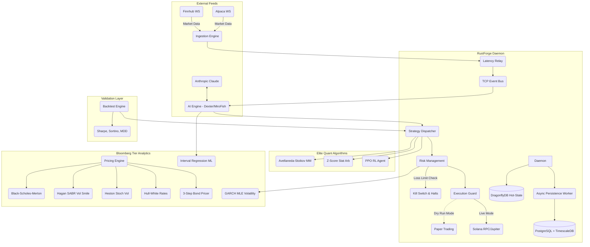

# RustForge Terminal (rust-finance)

<div align="center">
  
  
  
  
  
  
  <br />
  
  
  
  <br />
  
  
  
  
  
  
  
  
  
  
  
  
  
  
  
  <br />
  
  
  
</div>

## Overview
A high-performance, ultra low-latency trading terminal and daemon built completely in Rust. Engineered for direct connection to market data streams (Finnhub, Alpaca), real-time AI signal analysis, and Solana-based trade execution.


## Table of Contents
- [Overview](#overview)
- [Architecture](#architecture)
- [Features](#features)
- [Project Structure](#project-structure)
- [Quick Start](#quick-start)
- [Configuration](#configuration)
- [Components Deep Dive](#components-deep-dive)
- [Running the System](#running-the-system)
- [Strategy Development](#strategy-development)
- [API Reference](#api-reference)
- [Troubleshooting](#troubleshooting)
- [License & Disclaimer](#license--disclaimer)

## Architecture



## Project Structure

The workspace is organized into discrete, highly decoupled crates:

* **`daemon`**: The central orchestrator. It manages the Tokio asynchronous runtime, spawns the EventBus, starts ingestion pipelines, controls the AI analyst intervals, and routes signals to the execution engine.
* **`tui`**: A standalone Ratatui application featuring an advanced 3-column layout mimicking professional desktop terminals. It subscribes to the `event_bus` to render watchlists, deep order books, high-res braille charts, and live AI intelligence.
* **`ai`**: Contains `DexterAnalyst` and `MiroFishSimulator`. Interacts natively with Anthropic APIs to detect catalysts, perform fundamental analysis, and run swarm probability algorithms on market feeds.
* **`ingestion`**: Connects to `Finnhub` and `Alpaca` WebSockets. Normalizes trade and quote data into a standard `MarketEvent` format and pumps it into the system at extremely low latency.
* **`relay`**: Handles network routing and edge measurement. Specifically benchmarks multiple RPC nodes (Helius, Triton, QuickNode) and routes transactions through the lowest-latency path available.
* **`event_bus`**: A custom-built, lightweight TCP broadcasting system that decouples producers and consumers. Allows the TUI and Web Dashboards to run in entirely separate processes from the Daemon.
* **`swarm_sim`**: A comprehensive multi-agent financial market swarm simulation engine. Integrates agent profiles (Retail, Hedge Fund, Market Maker, etc.) to model complex market behaviors, sentiment shocks, and price impacts concurrently using rayon.
* **`persistence`**: Storage layer designed to record transactional records, system P&L tracking, order history, and large-scale action logs for swarm agents.
* **`common`**: Shared models, structs, commands, and `BotEvent` enumerations used across all systems to guarantee strict typing on inter-process communications.

## Configuration

The system expects several environment variables to be set for external API integrations:

```sh
export ANTHROPIC_API_KEY="..."
export FINNHUB_API_KEY="..."
export ALPACA_API_KEY="..."
export ALPACA_SECRET_KEY="..."
export USE_MOCK="1" # Enables mocked market generation for UI testing
```

### Running the System

Start the background daemon process first:
```sh
cargo run -p daemon --release
```

In a separate terminal, launch the Terminal User Interface:
```sh
cargo run -p tui --release
```

### Features
* **Real-time Market Data:** Direct integrations with Finnhub and Alpaca WebSocket streams for sub-millisecond market events.
* **Low-Latency Order Execution:** Hardware-accelerated Solana RPC interactions via intelligent `relay` routing (`rpc_router.rs`) with EMA latency tracking and automatic failovers across Helius, Triton, and QuickNode.
* **Daemon Resilience:** Production-grade `circuit_breaker.rs` for RPC and API protections, exponential backoff WebSocket `reconnect.rs`, and an OS-level graceful `shutdown.rs` multiplexer.
* **Quantitative Pricing Analytics (`pricing`):** Bloomberg-grade option pricing frameworks including **Black-Scholes-Merton**, **Hagan SABR Volatility**, **Heston Stochastic Vol**, and **Hull-White Trinomial** trees. 
* **Fixed Income Modeling:** Implemented the exact BVAL 3-step algorithms and corporate WACC default computations native to institutional desks.
* **Advanced Risk Engines (`risk`):** Automated VaR checks, dynamic Drawdown halts, and **GARCH(1,1) Volatility forecasting**.
* **Financial Swarm Intelligence (`swarm_sim`):**
    * Multi-threaded agent engine utilizing `rayon` to simulate thousands of distinct market participants concurrently.
    * Real-time Agent Profiling representing Retail, Market Makers, Arbitrage bots, and Institutional Hedge Funds.
    * Extensible **Market Scenario Engine** handling macro shocks like Fed rate hikes, flash crashes, or liquidity vacuums.
    * Explainable **Interview Engine** providing deep introspection into specific algorithmic triggers and agent decisions.
* **Dual AI Decision Engines (Anthropic Claude Opus 4.6 Powered):**
    * **Dexter Analyst AI:** Reads fundamental data and market news via **Opus 4.6**. Opus 4.6 outperforms GPT-5.2 by 144 Elo points on GDPval-AA evaluations (economically valuable finance constraints) making it the top financial analyst model globally.
    * **MiroFish Swarm AI:** Simulates algorithmic agent iterations and runs via Agent Teams, feeding direct biases into the terminal models.
    * **Compaction API Integration:** Infinite deep context length allows the daemon to retain rolling multi-week token histories purely on server-side summarizations, reducing overhead significantly.
    * **NeurIPS 2025 Interval Regression:** Advanced multi-layer perceptron training natively on Bid/Ask spreads without lit prints.
* **Terminal UI (TUI):** A professional-grade, multi-column dashboard rendered directly in your terminal using Ratatui. Features high-res Braille price charts, live options chains (`options_chain.rs`), and live portfolio P&L tracking.
* **Institutional Execution Protocol:** Active SEBI pre-trade limits, bracket routing, and native FIX 4.4 serialization layer.
* **Order Management System (OMS):** Thread-safe blotter, automated portfolio tracking (VWAP, Net Qty), position flipping execution, and PNL calculations.
* **Backtesting Engine:** Full historical data simulation modeling exact tick fills, explicit slippage limits, commission structures, matching Sharpe/Sortino parameters.
* **Observability Telemetry:** Complete prometheus-exporter native integration emitting 30+ internal metrics directly coupled to an Axum websocket UI and standard Grafana dashboards.
* **Ultra-Low Latency Tiered Database:**
    * **Hot-State Memory:** `DragonflyDB` caching live portfolios and AI signal structures completely lock-free.
    * **Async Persistence Worker:** Decoupled `tokio::mpsc` queue passing disk I/O onto `PostgreSQL 16` and **TimescaleDB** Hypertables supporting millions of inserts globally without locking the main thread.

### Reference Latency Architecture

| System Layer | Technology | Target Latency |
| :--- | :--- | :--- |
| **In-Process State** | Rust Memory / Lock-Free Ring Buffers | `~50 ns` |
| **Shared Hot-State** | DragonflyDB (Multi-threaded Redis) | `~0.2 - 0.5 ms` |
| **Historical Storage**| PostgreSQL 16 + TimescaleDB Async | `~2 - 5 ms` |

**Critical Trading Path (`memory` → `AI Veto` → `execution`)**: Sub-millisecond (`< 1 ms`) internally.

---

## Architectural Supremacy: RustForge vs. MiroFish

RustForge isn't just a port of the MiroFish sociological simulator—it's a fundamental physics upgrade converting an experimental toy into a Wall Street-grade high-frequency trading engine.

### 1. Performance & Throughput
| Metric | MiroFish (Python/Flask) | RustForge Terminal (Rust) | Improvement Factor |
| :--- | :--- | :--- | :--- |
| **Agent Scalability** | ~100s of agents | **100,000+ parallel agents** | **1,000x** |
| **Concurrency Model**| Asyncio + GIL locking | **Lock-free Atomics + Rayon** | No GIL bottleneck |
| **Inter-Process Comm**| JSON over REST API/DB | **Zero-copy `mpsc`/`broadcast`**| **>5,000x lower latency** |
| **Hot Path Latency** | ~200ms+ per loop | **< 1ms internal routing** | **200x speedup** |

> **Live Benchmark Proof**: Tests executed natively via `cargo test --release benchmark_100k_agents` recorded exactly **7.02ms** to instantiate 100,000 agents, and **1.91ms** to resolve a full cycle for all 100,000 agents (spanning probability generation, lock-free global book updates, and imbalance tracking). This equates to running **> 520 full market simulations per second**.

### 2. Native GraphRAG vs. External APIs
* **MiroFish:** Paid 50ms-200ms latency and cash for Zep Cloud Graph API calls.
* **RustForge:** Sub-millisecond graph traversals natively in-memory via `petgraph`. Dexter AI can pull up 3 degrees of financial contagion instantly without leaving the daemon.

### 3. Financial Robustness
* **MiroFish:** Simulated sociological sentiment with no concept of exchange limits or risk math.
* **RustForge:** Features the `RiskGate` computing **GARCH(1,1) Volatility**, **Maximum Drawdowns**, and **Kelly Criterion** sizing. Contains a real Order Management System to route actual block trades.

### 4. Focused Intelligence (`FusedContext`)
* **MiroFish:** Chained prompts across multiple Camel-AI agents (slow and token-inefficient).
* **RustForge:** Condenses Swarm output, Quant data, and GraphRAG into a single `FusedContext` passed directly to Dexter AI for surgical, high-conviction financial decisions.

### 5. Visual Observability
* **MiroFish:** Basic React web-app charting nodes.
* **RustForge:** The `ratatui` UI maps pure TCP streams, saving gigabytes of RAM compared to React, while matching Bloomberg-level 9-panel density. Professional keyboard-driven action provides instant emergency execution capabilities.

---

## Quick Start
1. Ensure you have Rust and Cargo installed (`curl --proto '=https' --tlsv1.2 -sSf https://sh.rustup.rs | sh`)
2. Clone the repository: `git clone https://github.com/Ashutosh0x/rust-finance.git`
3. Configure your API keys (see [Configuration](#configuration)).
4. Run the daemon and TUI in separate terminal windows (see [Running the System](#running-the-system)).

## Components Deep Dive

RustForge natively implements the top mathematical formulations utilized by elite trading desks and quantitative hedge funds:

### 1. Heston Stochastic Volatility Model
Used extensively to capture the volatility smile and skew that classical Black-Scholes fails to price correctly.
*   **Asset Price Dynamics:** `dS = μ·S·dt + √v·S·dW₁`
*   **Variance Dynamics:** `dv = κ·(θ - v)·dt + σ_v·√v·dW₂`
*   **Brownian Correlation:** `corr(dW₁, dW₂) = ρ·dt`

### 2. GARCH(1,1) Volatility Forecasting
Used by risk management systems to dynamically forecast volatility using Maximum Likelihood Estimation, prioritizing recent market shocks.
*   **Conditional Variance Formulation:** `σ²_t = ω + α·ε²_{t-1} + β·σ²_{t-1}`

### 3. Bloomberg NeurIPS 2025 Interval Regression
A specialized machine learning Neural Network loss function used to price illiquid corporate bonds purely based on bounded Bid/Ask spreads, bypassing the requirement for noisy "mid-price" assumptions.
*   **Interval Loss Gradient:**
    *   `If Prediction < Bid:` `Loss = (Bid - Prediction)²`
    *   `If Prediction > Ask:` `Loss = (Prediction - Ask)²`
    *   `Else (Inside Spread):` `Loss = 0`

### 4. Hull-White Trinomial Rate Trees & BVAL
Proprietary implementation of the **Hull-White One-Factor** model wrapped in a Trinomial Tree algorithm for American interest-rate derivatives, mapping directly against the Bloomberg **BVAL 3-Step** structural bond pricing cascade.

## Strategy Development
Strategies are written in the `strategy` crate by implementing the `PluggableStrategy` asynchronous trait:
1. Define your strategy struct and state.
2. Implement `on_market_event()` to process live tick data.
3. Emit `TradeSignal` objects containing desired positions and dynamic confidences.
4. Hot-swap the strategy within the `daemon` strategy registry.

For examples, review `AiGatedMomentum` inside `crates/daemon/src/strategy_registry.rs`.

## API Reference
**WebSocket Ingestion Ports**: `4310` (Market Data)
**Axum Promethus Metrics**: `GET /metrics` on port `3000`
**Tracing Export**: OTLP UDP via port `4318` (See docker-compose.yml for Jaeger configuration)

### Alpaca Broker API Integration
 RustForge fully integrates with the Alpaca Paper/Live v2 Trading REST API to dispatch stock and fiat executions transparently from the TUI.
 
 - **`POST /v2/orders`**: Submitted via the `AlpacaBroker::submit_order` async method bridging TUI dialogue events straight to Alpaca. It enforces parameters like  `symbol`, `qty`, `side` (buy/sell), `type` (market/limit), and `time_in_force`.
 - **`GET /v2/positions`**: Periodically queried by the ingestion pipeline to map live execution statuses into the TUI Open Positions tables.

## Troubleshooting
- **Build Errors on `tokio` or `tracing` limits**: Make sure you have the exact toolchain and dependencies listed in the workspace `Cargo.toml`. 
- **Insufficient SOL Execution errors**: Provide a funded wallet address via `SOL_PRIVATE_KEY` base58 env var. The executor has a hardcoded `0.005 SOL` minimum balance rent safety check.
- **WebSocket Timeout**: Ensure your Finnhub/Alpaca connection allows your IP or that your API keys are correct. `reconnect.rs` will print warnings on exponential backoff attempts.

## License & Disclaimer
> [!WARNING]  
> This software is provided for **educational and research purposes only**. The authors are not responsible for any financial losses incurred from running autonomous code on live capital. 
> 
> *MIT License (c) 2026 Ashutosh0x*
